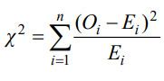

# Aufgabe 2: Cäsar-Chiffre (Python)

Einsendeaufgabencode: B-GOPB01-XX2-K04  
Bearbeiter: Maxim Heibach  
Matrikelnummer: 909442

## Aufgabe
Die Cäsar-Verschlüsselung ist ein einfaches und sehr unsicheres Verfahren zur Verschlüsselung eines Textes. Jeder Buchstabe wird um eine durch den Schlüssel bestimmte Anzahl Buchstaben im Alphabet zyklisch verschoben.
Beispiel: Angenommen, der Schlüssel sei 3. Der Klartext  
*Das ist ein Text.*  
wird dann verschlüsselt zu  
*Gdv lvw hlq Whaw.*

1. Implementieren Sie eine Python-Funktion `encode_text(text, key)`, die den übergebenen Text nach dem Cäsar-Verfahren verschlüsselt und den verschlüsselten Text zurückliefert.  

    Zum Entschlüsseln rufen Sie die Funktion *encode_text* mit dem negativen Schlüssel auf:   
`encode_text("Gdv lvw hlq Whaw.", -3)`   

    Alternativ kann `encode_text` zum Entschlüsseln auch mit `26-key` aufgerufen werden (das Alphabet hat 26 Buchstaben):  
    `encode_text("Gdv lvw hlq Whaw.", 26-3)`  

    Hinweise: Verwenden Sie die String-Methoden `isupper`, `islower` und die Funktionen `ord` und `chr`. Nur Buchstaben sollen verschlüsselt werden. Sonstige Zeichen werden unverändert in den verschlüsselten Text übernommen. Sie können davon ausgehen, dass der Text nur ASCII-Zeichen (also keine Umlaute, kein ß)
enthält. Implementieren Sie zudem ein Hauptprogramm `(main)`, sodass das Python-Skript wie folgt auf der Konsole aufgerufen werden kann:
    ```sh
    python caesar.py "Das ist ein Text" 3
    ``` 
    Wenn weniger als zwei Parameter übergeben wurden, soll das Skript mit einer Fehlermeldung abbrechen.

2. Implementieren Sie eine Python-Funktion `string_histogram(text)`, die ein Dictionary zurückliefert, das für jeden vorkommenden Buchstaben die Häufigkeit im Text zählt.   

    Für das Beispiel  
`string_histogram("Das ist ein Text")`  
    ergibt sich:  
{'d': 1, 'a': 1, 's': 2, 'i': 2, 't': 3, 'e': 2, 'n': 1, 'x': 1}

    Hinweis: Verwenden Sie die String-Methoden isalpha und lower.

3. Nun möchten wir ermitteln, mit welcher Frequenz bzw. Wahrscheinlichkeit ein bestimmter Buchstabe im Text vorkommt. Implementieren Sie hierzu eine Python-Funktion  
`frequencies(histogram)`  
die für ein übergebenes String-Histogramm eine Liste der Länge 26 mit den zugehörigen Wahrscheinlichkeiten zurückliefert („Wahrscheinlichkeitsvektor“).

    Für den Aufruf  
`frequencies(string_histogram("Das ist ein Text"))`  
ergibt sich beispielsweise:  
[0.07692307692307693, 0, 0, 0.07692307692307693,
0.15384615384615385, 0, 0, 0, 0.15384615384615385, 0, 0, 0, 0,
0.07692307692307693, 0, 0, 0, 0, 0.15384615384615385,
0.23076923076923078, 0, 0, 0, 0.07692307692307693, 0, 0]  
(der Buchstabe 'a' kommt mit 7,69 % Wahrscheinlichkeit im Text vor, der Buchstabe 'b' kommt gar nicht im Text vor usw.)

4. Zuletzt möchten wir die Cäsar-Verschlüsselung knacken. Hierzu bestimmen wir anhand eines bekannten, längeren Beispieltexts die Wahrscheinlichkeiten, wie oft ein einzelner Buchstabe des Alphabets in diesem Text vorkommt. Danach probieren wir für den verschlüsselten Text alle 26 möglichen Schlüssel durch und vergleichen die Buchstabenfrequenzen mit den Frequenzen des Beispieltexts. Der Schlüssel mit dem kleinsten „Abstand“ zum Beispieltext
entschlüsselt mit großer Wahrscheinlichkeit den Text.  

    Implementieren Sie hierzu eine Python-Funktion  
`crack_caesar(exampletext, text)`  
die den Code knackt und den Klartext zum verschlüsselten Argument text zurückliefert.  

    Für den Vergleich der Wahrscheinlichkeitsvektoren eignet sich die Funktion χ² („Chisquared“):

    

    Hierbei bezeichnet n die Anzahl der Buchstaben im Alphabet, E den Wahrscheinlichkeitsvektor des Beispieltexts und O den Wahrscheinlichkeitsvektor des verschlüsselten Texts. Je kleiner χ2, desto ähnlicher sind sich die beiden Wahrscheinlichkeitsvektoren.  

    Als Beispieltext können Sie den folgenden Ausschnitt aus dem Stück „Julius Caesar“ von William Shakespeare verwenden:  
*I know that virtue to be in you, Brutus, As well as I do know your outward favour. Well, honour is the subject of my story. I cannot tell what you and other men Think of this life; but, for my single self, I had as lief not be as live to be In awe of such a thing as I myself. I was born free as Caesar; so were you: We both have fed as well, and we can both Endure the winter's cold as well as he: For once, upon a raw and gusty day, The troubled Tiber chafing with her shores, Caesar said to me 'Darest thou, Cassius, now Leap in with me into this angry flood, And swim to yonder point?' Upon the word, Accoutred as I was, I plunged in And bade him follow; so indeed he did. The torrent roar'd, and we did buffet it With lusty sinews, throwing it aside And stemming it with hearts of controversy; But ere we could arrive the point proposed, Caesar cried 'Help me, Cassius, or I sink!' I, as Aeneas, our great ancestor, Did from the flames of Troy upon his shoulder The old Anchises bear, so from the waves of Tiber Did I the tired Caesar. And this man Is now become a god, and Cassius is A wretched creature and must bend his body, If Caesar carelessly but nod on him. He had a fever when he was in Spain, And when the fit was on him, I did mark How he did shake: 'tis true, this god did shake; His coward lips did from their colour fly, And that same eye whose bend doth awe the world Did lose his lustre: I did hear him groan: Ay, and that tongue of his that bade the Romans Mark him and write his speeches in their books, Alas, it cried 'Give me some drink, Titinius,' As a sick girl. Ye gods, it doth amaze me A man of such a feeble temper should So get the start of the majestic world And bear the palm alone.*

    Bestimmen Sie anhand der Funktion `crack_caesar` sodann den Klartext zu dem folgenden verschlüsselten Text:  
*Reu jf zk zj. Wfi kyzj kzdv Z nzcc cvrmv pfl: Kf-dfiifn, zw pfl gcvrjv kf jgvrb nzky dv, Z nzcc tfdv yfdv kf pfl; fi, zw pfl nzcc, Tfdv yfdv kf dv, reu Z nzcc nrzk wfi pfl.*

## Probleme:
- Die Methode `crack_caesar` liefert für unsinnige (z.B. "xxxx") und teilweise auch für kurze Texte (z.B. "Das ist ein Text.") keine verlässliche Entschlüsselung, falls dieser Text zuvor verschlüsselt wurde. Wie lang ein Text mindestens sein muss scheint mit der Verteilung der Buchstaben im zu verschlüsselten Text in Bezug auf den Beispieltext zu liegen. Der Wert von Chi-squared ist in diesen Fällen für den richtigen Schlüssel höher als bei einem anderen, falschen Schlüssel, weshalb die korrekte Entschlüsselung scheitert. Auf Grund des Hinweises in der Aufgabenstellung, dass nur mit "großer Wahrscheinlichkeit" die Entschlüsselung glückt, wird diese Unzuverlässigkeit des Programms hingenommen und hiermit auf das vorhandene Problem verwiesen.

- Dem Beispieltext mussten die Buchstaben "q" und "x" hinzugefügt werden, da die minimale Anzahl eines Buchstabens auf Grund des Chi-squared-Tests mindestens 1 sein muss, da andernfalls durch 0 dividiert werden würde.
